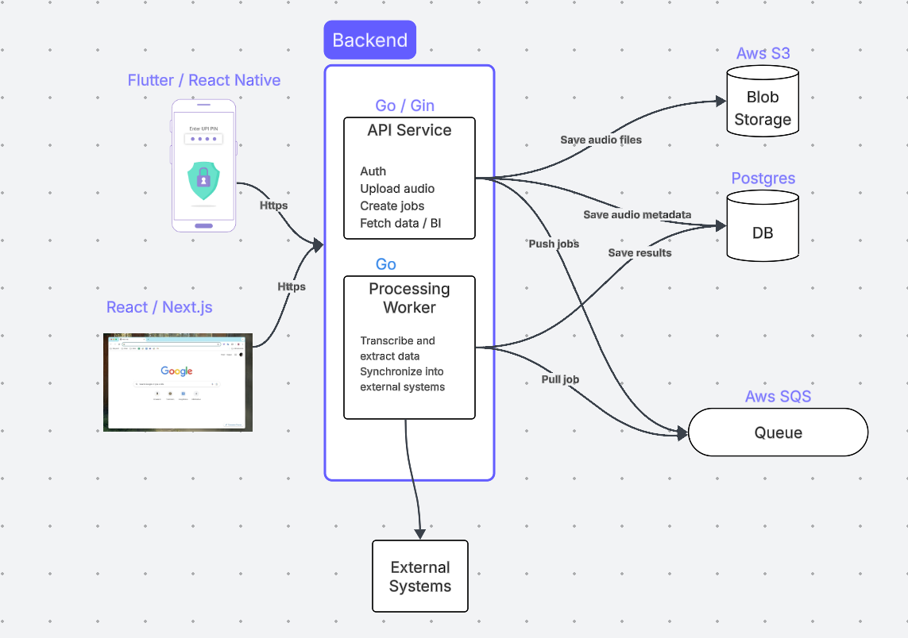

# VoiceLine App

## Intro
VoiceLine enables field sales to convert spoken conversations into structured, actionable dat that integrates seamlessly into CRMs and other entreprise systems. In addition, it provides users with an analytics and BI tools in order to gain more insights about their operations.

## Functional requirements
* The user can record and submit an audio
* The system transcribes the speech to text
* The system extracts structured data from the text
* The system synchronizes the data into external systems
* The system provides users with analytics and BI informations

## Non-functional requirements
The system must support:
* Async processing
* AI workflows
* External API inegrations
* Reliability and fault tolerance

## Architecture & technologies
Core building blocks diagram:
